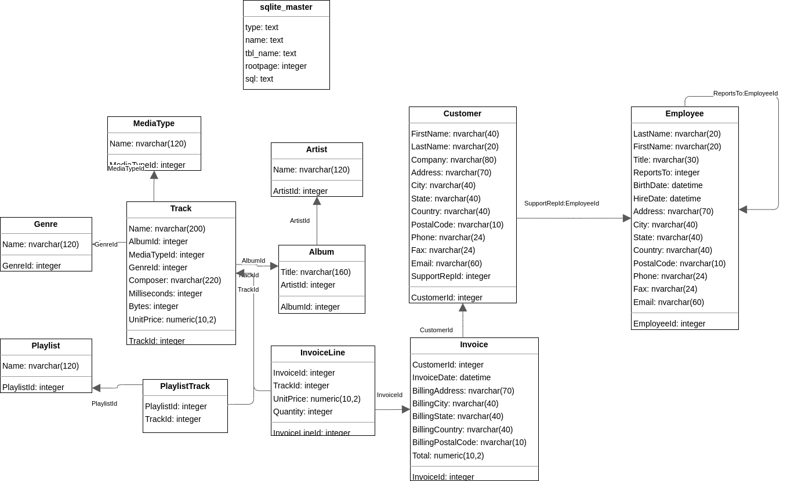

Here's the `README.md` file in English:

# Basic JDBC Album Management

This repository contains a practice project demonstrating CRUD operations using the JDBC API in Java with an SQLite database. The project allows you to manage a collection of albums and artists through an interactive console menu.

## Features

The program offers the following functionalities through an interactive menu:

1. **List all albums**: Displays all the albums stored in the database.
2. **Select a single album**: Allows you to select and view the details of a specific album.
3. **Add a new album**: Allows you to add a new album to the database.
4. **Edit an album**: Allows you to modify the details of an existing album.
5. **Delete an album**: Allows you to remove an album from the database.
6. **Exit**: Exits the program.

## Requirements

- Java 11 or higher
- SQLite Database

## Project Structure

The project is organized as follows:

- **MainBasic.java**: The main file that manages the interactive menu and performs CRUD operations.
- **Album.java**: A class representing an album and containing methods to perform CRUD operations on the database.
- **Artist.java**: A class representing an artist and containing methods to check the existence of artists and manage them.

## How to Use

1. Clone this repository:
   ```bash
   git clone https://github.com/Daruuu/JDBC.git
   ```

2. Compile the source code:
   ```bash
   javac albumBasicJDBC/MainBasic.java
   ```

3. Run the program:
   ```bash
   java albumBasicJDBC.MainBasic
   ```

4. Interact with the menu and select the available options to manage albums.




## Example Usage

When you run the program, the user will see the following menu options:


Please choose an option to execute:
1) List all albums
2) Select a single album
3) Add a new album
4) Edit an album
5) Delete an album
0) Exit

Each option performs an action related to album management, such as displaying albums, adding a new one, modifying, or deleting an existing album.

